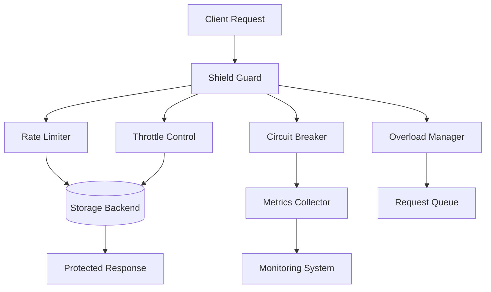

# NestShield Documentation

<p align="center">
  
</p>

<p align="center">
  <strong>Enterprise-Grade Protection for NestJS Applications</strong><br>
  <em>Comprehensive security, reliability, and performance management for your APIs</em>
</p>

## 📚 Documentation Overview

Welcome to the NestShield documentation! This comprehensive guide will help you protect your NestJS applications with enterprise-grade security features.

### 🚀 Quick Navigation

#### Getting Started
- [**Installation & Setup**](./getting-started.md) - Get NestShield up and running in minutes
- [**Basic Usage**](./basic-usage.md) - Learn the fundamentals
- [**Examples**](./examples/index.md) - Real-world implementation examples

#### Core Features
- [**Rate Limiting**](./features/rate-limiting.md) - Control request rates and prevent abuse
- [**Throttling**](./features/throttling.md) - Manage request frequency
- [**Circuit Breaker**](./features/circuit-breaker.md) - Prevent cascade failures
- [**Overload Protection**](./features/overload-protection.md) - Handle traffic spikes gracefully

#### Advanced Features
- [**Anomaly Detection**](./anomaly-detection/index.md) - AI-powered threat detection
- [**Metrics & Monitoring**](./features/metrics.md) - Comprehensive observability
- [**Distributed Systems**](./features/distributed.md) - Multi-instance coordination
- [**Custom Strategies**](./advanced/custom-strategies.md) - Extend NestShield

#### Configuration & Deployment
- [**Configuration Guide**](./configuration.md) - Detailed configuration options
- [**Storage Backends**](./storage/index.md) - Redis, Memcached, and more
- [**Production Deployment**](./deployment/production.md) - Best practices for production
- [**Performance Tuning**](./deployment/performance.md) - Optimization strategies

#### Reference
- [**API Reference**](./api/index.md) - Complete API documentation
- [**Decorators**](./api/decorators.md) - All available decorators
- [**Services**](./api/services.md) - Service APIs
- [**Interfaces**](./api/interfaces.md) - TypeScript interfaces

#### Resources
- [**Troubleshooting**](./troubleshooting.md) - Common issues and solutions
- [**Migration Guide**](./migration.md) - Upgrading from older versions
- [**FAQ**](./faq.md) - Frequently asked questions
- [**Contributing**](./contributing.md) - How to contribute

## 🎯 What is NestShield?

NestShield is a comprehensive protection system for NestJS applications that provides:

### 🛡️ **Protection Features**
- **Rate Limiting**: Prevent API abuse and enforce usage quotas
- **Throttling**: Control request frequency per client
- **Circuit Breaker**: Stop cascading failures in distributed systems
- **Overload Protection**: Gracefully handle traffic spikes
- **Anomaly Detection**: AI-powered threat identification

### 📊 **Monitoring & Analytics**
- **Real-time Metrics**: Track performance and security events
- **Multiple Backends**: Prometheus, StatsD, CloudWatch, Datadog
- **Custom Dashboards**: Build your own monitoring solutions
- **Alert Integration**: Slack, email, webhook notifications

### 🚀 **Enterprise Ready**
- **Distributed Support**: Redis/Memcached for multi-instance deployments
- **High Performance**: Minimal overhead, optimized algorithms
- **Production Tested**: Battle-tested in high-traffic environments
- **TypeScript First**: Full type safety and IntelliSense support

## 💡 Why NestShield?

### The Problem
Modern APIs face numerous challenges:
- DDoS attacks and abuse
- Unpredictable traffic spikes
- Cascading failures in microservices
- Resource exhaustion
- Compliance requirements

### The Solution
NestShield provides a unified solution:
```typescript
@Controller('api')
@Shield({
  rateLimit: { points: 1000, duration: 3600 },
  circuitBreaker: { timeout: 5000 },
  overload: { maxConcurrentRequests: 100 }
})
export class ApiController {
  // Your API is now protected! 🛡️
}
```

## 🏗️ Architecture Overview



## 🚦 Quick Start

### 1. Installation
```bash
npm install @usex/nest-shield
# or
yarn add @usex/nest-shield
# or
pnpm add @usex/nest-shield
```

### 2. Basic Setup
```typescript
import { Module } from '@nestjs/common';
import { ShieldModule } from '@usex/nest-shield';

@Module({
  imports: [
    ShieldModule.forRoot({
      global: { enabled: true },
      rateLimit: {
        enabled: true,
        points: 100,
        duration: 60
      }
    })
  ]
})
export class AppModule {}
```

### 3. Protect Your Endpoints
```typescript
@Controller('users')
export class UserController {
  @Get()
  @RateLimit({ points: 10, duration: 60 })
  findAll() {
    return this.userService.findAll();
  }
}
```

## 📖 Documentation Structure

Our documentation is organized to help you find information quickly:

### For New Users
1. Start with [Getting Started](./getting-started.md)
2. Review [Basic Usage](./basic-usage.md)
3. Explore [Examples](./examples/index.md)

### For Integration
1. Check [Configuration Guide](./configuration.md)
2. Choose your [Storage Backend](./storage/index.md)
3. Set up [Monitoring](./features/metrics.md)

### For Production
1. Read [Production Deployment](./deployment/production.md)
2. Configure [Performance Tuning](./deployment/performance.md)
3. Set up [Anomaly Detection](./anomaly-detection/index.md)

### For Advanced Users
1. Build [Custom Strategies](./advanced/custom-strategies.md)
2. Implement [Custom Metrics](./advanced/custom-metrics.md)
3. Create [Custom Storage](./advanced/custom-storage.md)

## 🤝 Community & Support

### Get Help
- 📖 [Documentation](https://github.com/ali-master/nest-shield/docs)
- 🐛 [Issue Tracker](https://github.com/ali-master/nest-shield/issues)
- 📧 [Email Support](mailto:ali_4286@live.com)

### Contributing
We welcome contributions! See our [Contributing Guide](./contributing.md) to get started.

## 📄 License

NestShield is [MIT licensed](../LICENSE).

---

<p align="center">
  Made with ❤️ by the Ali Torki<br>
  <a href="https://github.com/ali-master/nest-shield">GitHub</a> •
  <a href="https://www.npmjs.com/package/@usex/nest-shield">NPM</a> •
  <a href="https://nestshield.usestrict.dev">Website</a>
</p>
